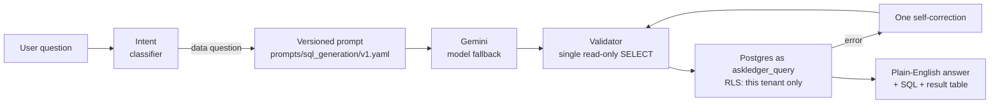

# AskLedger

[](https://github.com/tarunnbali/AskLedger/actions/workflows/ci.yml)

**A multi-tenant text-to-SQL assistant: ask billing questions in plain English, get answers from your own data only, with CI gates that block tenant-data leaks and SQL-accuracy regressions.**

**[Live demo →](https://ask-ledger.vercel.app)** · demo logins `alice` / `bob` / `charlie`, password `password123`

---

## Quality gates

Every pull request has to pass these before it can merge.

| Gate | What it does | Status |
|---|---|---|
| **Tenant isolation** | 15 tests that try to read another tenant's data: straight at the database as the app's role, and end to end through `/chat` with the LLM replaced by hostile SQL. They check that RLS is enabled *and forced* on every tenant table, that no app role can bypass it, and that tenant context never survives on a pooled connection. | [backend/tests/test_tenant_isolation.py](backend/tests/test_tenant_isolation.py) |
| **SQL accuracy** | A 40-question benchmark with hand-written gold queries, scored by *execution accuracy*: run the model's SQL and the gold SQL as the same tenant and compare results. Fails below a floor or more than 5 points under the baseline. | Prompt v1: **95% (38/40)**. See [evals/](evals/) |
| **Prompt review** | Prompts are versioned YAML files ([backend/prompts/](backend/prompts/)). A change is a new version, reviewed like code and scored by the accuracy gate. | `SQL_PROMPT_VERSION=v1` |
| **Unit tests + lint** | SQL validator, probes, metrics, prompt rendering, intent parsing. Ruff, ESLint, TypeScript. | 29 tests |
| **Image** | Multi-stage, non-root image. Trivy fails the build on fixable HIGH/CRITICAL vulnerabilities; published to GHCR from `main`. | [backend/Dockerfile](backend/Dockerfile) |

### What the gates caught while being built

Writing the isolation tests first, against the existing code, surfaced two real leaks:

1. **The chat could return every tenant's password hashes.** The app's database role could read `users` (it needs it for login), and nothing stopped generated SQL from querying it. The test made `/chat` run `SELECT username, password_hash FROM users` and got alice's *and* bob's bcrypt hashes back. Fixed by running chat queries as a separate `askledger_query` role that can only read the four tenant tables.
2. **The tenant ID outlived the request.** `SET app.current_tenant` inside a committed transaction stays on the pooled connection, so any code path that forgot to set it would run as the previous request's tenant. Fixed with transaction-local `set_config(…, true)`, bound as a parameter.

Earlier in the project, the same class of bug showed up in production: Neon's default owner role has `BYPASSRLS`, which silently disabled every policy. The gate now checks role attributes explicitly.

## How a question is answered



## Run it locally

```bash
pip install -r backend/requirements-dev.txt pgserver   # pgserver = embedded Postgres for tests
(cd backend && pytest)                                 # 44 tests, including the isolation gate
python evals/run_eval.py --check-gold                  # validate the benchmark; add GEMINI_API_KEY to score it
```

To run the whole app against a real database:

```bash
cd backend
cp .env.example .env                    # ADMIN_DATABASE_URL, GEMINI_API_KEY, JWT_SECRET
python -m scripts.setup_database --rotate-password   # schema, RLS, roles; prints the app's DATABASE_URL
python -m scripts.seed_data             # demo tenants
uvicorn app.main:app --reload           # then: cd ../frontend && npm install && npm run dev
```

## Design decisions and trade-offs

- **Isolation lives in the database, not the prompt.** The LLM is told not to filter by tenant; Row-Level Security does it, so a wrong or hostile query still can't cross tenants. The tests attack the database directly for that reason.
- **Two roles, not one.** Login needs `users`; generated SQL must never see it. A `NOINHERIT` login role that switches to a narrow query role per transaction gives each path only what it needs.
- **Execution accuracy, not string matching.** Two different SQL queries can both be right. Comparing results (ignoring row order and extra columns) scores answers the way a user would.
- **Evals are cached by prompt + model + question.** Pull requests that don't change the prompt re-check answers against a fresh database without spending Gemini quota; Gemini outages make a run *inconclusive* rather than failing it.
- **Free-tier hosting.** Vercel (frontend), Render (API) and Neon (Postgres) cost nothing. The trade-offs are cold starts and small AI quotas, handled with a keep-warm job, model fallback and fail-fast timeouts.

## Observability

`/health` (liveness), `/ready` (database + prompt), and `/metrics` (Prometheus): request rate and latency, LLM calls by model and outcome, tokens, SQL validation rejections, execution errors and empty results by prompt version.

## Repository layout

```
backend/    FastAPI app, versioned prompts, database setup, tests
frontend/   Next.js site and chat widget
evals/      SQL accuracy benchmark and gate
infra/      Terraform (phase 2)
deploy/     Helm chart and Argo CD config (phase 2)
docs/       Design notes and postmortems
```

More detail: [backend/README.md](backend/README.md), [backend/SCHEMA.md](backend/SCHEMA.md), [evals/README.md](evals/README.md).
