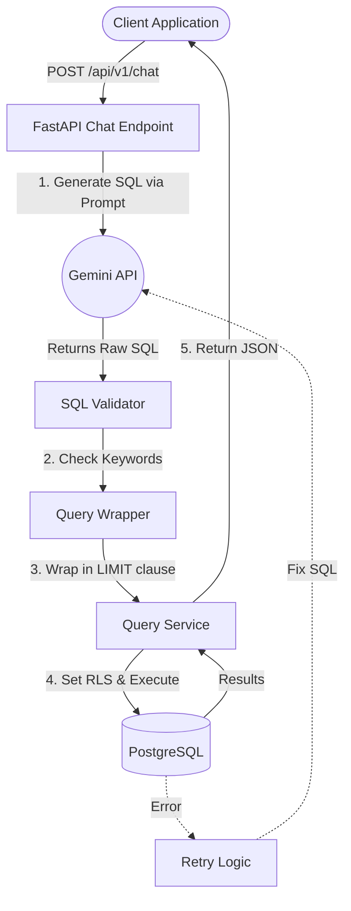
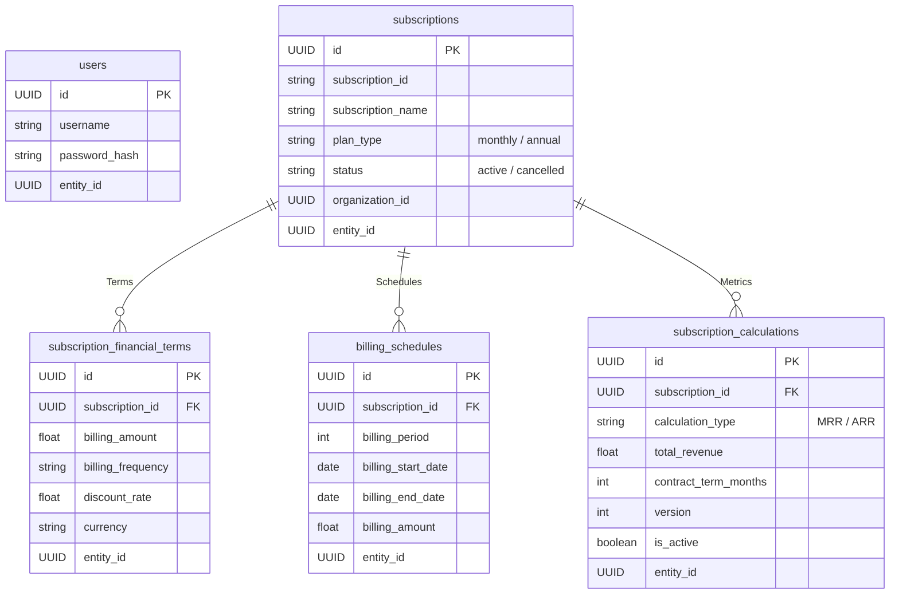

# 🤖 AskLedger — Backend

An enterprise-ready, FastAPI-based backend that transforms natural language questions into secure PostgreSQL queries using Google Gemini. Architected specifically for multi-tenant SaaS environments, it enforces strict data isolation and SQL validation, guaranteeing that users can only query their own data.

## 🛠️ Tech Stack
| Component | Technology | Use Case |
|-----------|------------|----------|
| **Web framework** | **FastAPI** | High-performance API server with native async support and OpenAPI docs. |
| **Database ORM** | **SQLAlchemy 2.x** | Declarative models for the database and typed relationships. |
| **Database** | **PostgreSQL** | Primary datastore (requires `psycopg2-binary`). |
| **LLM for NL‑to‑SQL** | **Google Gemini** | LLM orchestrator leveraging Gemini's OpenAI-compatible endpoint via the `openai` SDK. |
| **Configuration** | **pydantic‑settings** | Strongly typed config parsing from `.env` files. |
| **Server** | **uvicorn** | ASGI web server. |

---

## 🔄 The Flow

1. **Client Request:** Client sends a POST request with natural language (`What is my MRR?`).
2. **LLM Generation:** The backend merges the question with schema context and prompts the LLM for a raw SQL `SELECT` string.
3. **Validation & Wrapping:** The SQL undergoes strict anti-DML (Data Manipulation) keyword checks. It is then safely wrapped in a subquery `SELECT * FROM (<query>) LIMIT X` to guarantee performance.
4. **Execution:** The SQL executes through SQLAlchemy against PostgreSQL. If the query logically fails, the exception is quietly fed back to the LLM for exactly one self-correction attempt. 
5. **Response:** The valid results are transmitted back to the client.

---

## 🛡️ Tenant Isolation

Tenant isolation is enforced by **PostgreSQL Row-Level Security**, not by the prompt, so a wrong or hostile generated query still can't cross tenants.

1. **Authentication:** each request carries a JWT; the server looks up the user's `entity_id` (tenant).
2. **Two database roles:** the app connects as `askledger_app` (`NOINHERIT`, no `BYPASSRLS`), which can read `users` for login but no tenant data. Each chat query runs inside a transaction that switches to `askledger_query` (`SET LOCAL ROLE`), which can read only the four tenant tables.
3. **Transaction-scoped tenant:** `SELECT set_config('app.current_tenant', :tenant, true)` sets the tenant for that transaction only, so it never lingers on a pooled connection.
4. **RLS policies** ([db/rls.sql](db/rls.sql)) are enabled *and forced* on every tenant table and filter by `app.current_tenant`. With no tenant set, queries see nothing.
5. **Verified on every pull request** by the isolation gate in [tests/test_tenant_isolation.py](tests/test_tenant_isolation.py).

Setup is one idempotent command (`python -m scripts.setup_database`), shared with the tests so they check the real configuration.

---

## 🗄️ Database Design

The database tracks the core entities of a B2B SaaS architecture, interlinked by foreign keys and partitioned universally by `entity_id`.

